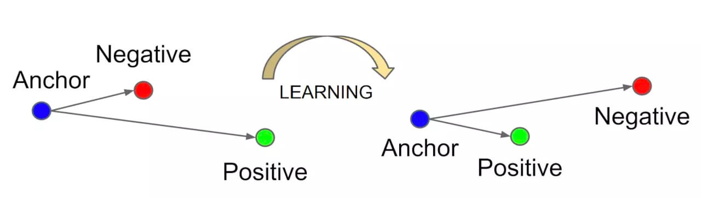
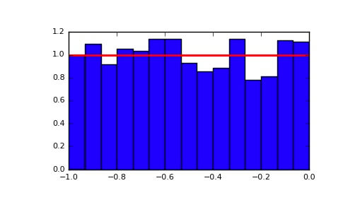
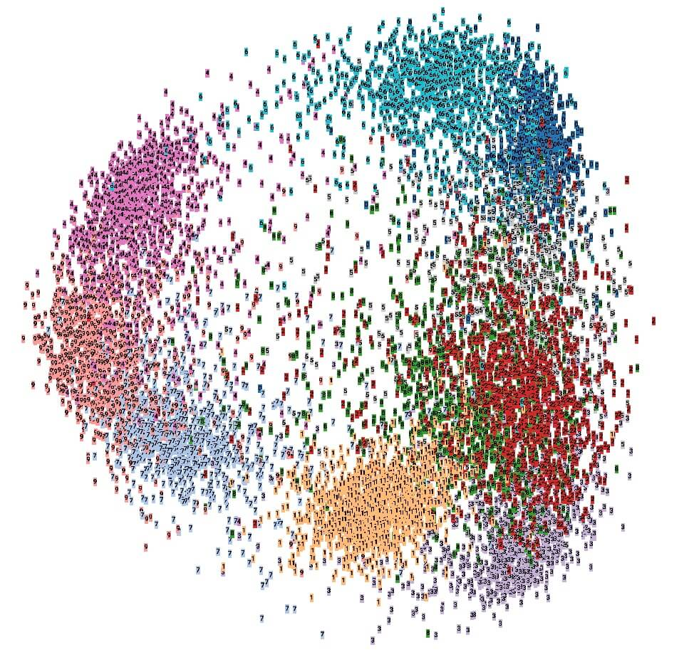
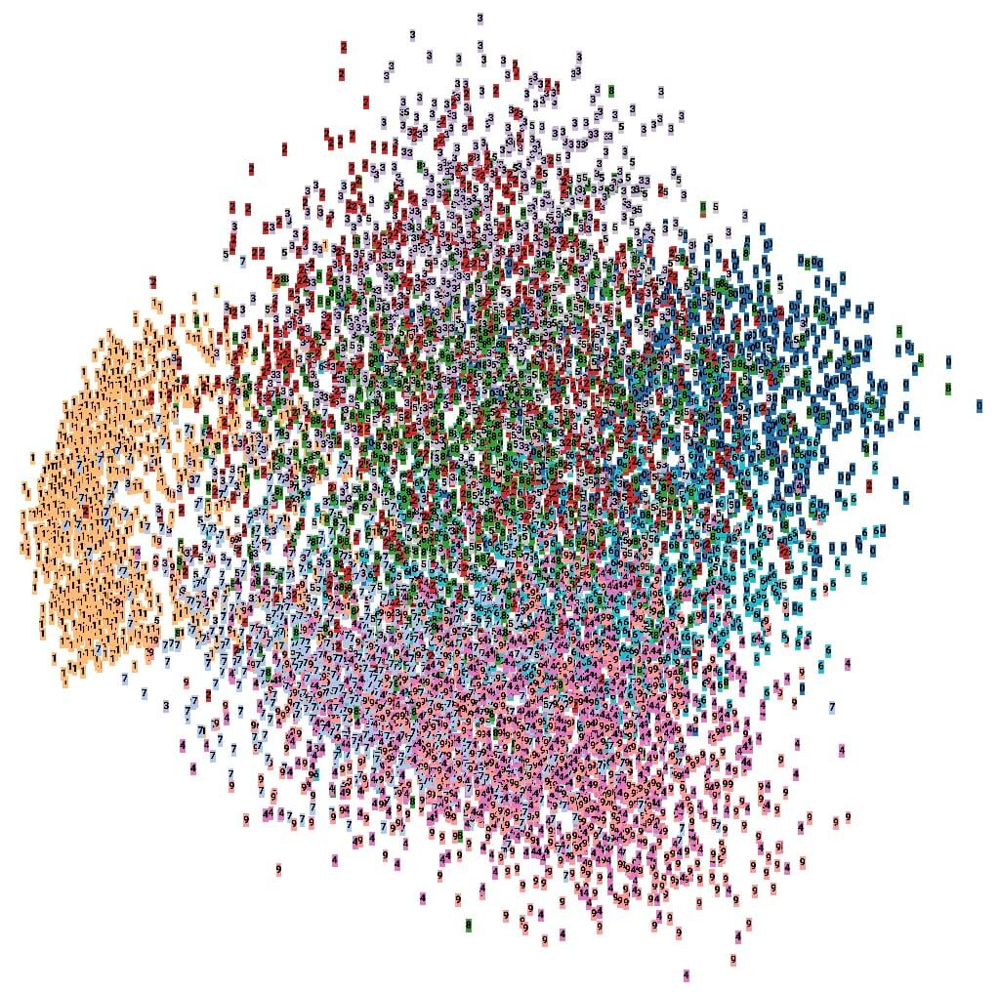

# MXNet / Gluon 中 Triplet Loss 算法

Triplet Loss，即三元组损失，用于训练差异性较小的数据集，数据集中标签较多，标签的样本较少。输入数据包括*锚（Anchor）示例*⚓️、*正（Positive）示例*和*负（Negative）示例*，通过优化模型，使得锚示例与正示例的距离**小于**锚示例与负示例的距离，实现样本的相似性计算。其中锚示例是样本集中随机选取的一个样本，正示例与锚示例属于同一类的样本，而负示例与锚示例属于不同类的样本。



在训练Triplet Loss模型时，只需要输入样本，不需要输入标签，这样避免标签过多、同标签样本过少的问题，模型只关心样本编码，不关心样本类别。Triplet Loss在相似性计算和检索中的效果较好，可以学习到样本与变换样本之间的关联，检索出与当前样本最相似的其他样本。

Triplet Loss通常应用于个体级别的**细粒度**识别，比如分类猫与狗等是大类别的识别，但是有些需求要精确至个体级别，比如识别不同种类不同配色的猫🐈等，所以Triplet Loss最主要的应用也是在细粒度检索领域中。

Triplet Loss的对比：

- 如果把不同个体作为类别进行分类训练，Softmax维度可能远大于Feature维度，精度无法保证。
- Triplet Loss一般比分类能学习到更好的特征，在度量样本距离时，效果较好；
- Triplet Loss支持调整阈值Margin，控制正负样本的距离，当特征归一化之后，通过调节阈值提升置信度。

Triplet Loss的[公式](https://math.meta.stackexchange.com/questions/5020/mathjax-basic-tutorial-and-quick-reference)：


其他请参考Triplet Loss算法的[论文](https://arxiv.org/abs/1503.03832)。

本文使用``MXNet/Gluon``深度学习框架，数据集选用[MNIST](http://yann.lecun.com/exdb/mnist/)，实现Triplet Loss算法。

---

## 数据集

安装MXNet库：

``` text
pip install mxnet
```

> 推荐豆瓣源下载，速度较快，-i https://pypi.douban.com/simple

[MNIST](http://yann.lecun.com/exdb/mnist/)就是著名的手写数字识别库，其中包含0至9等10个数字的手写体，图片大小为28*28的灰度图，目标是根据图片识别正确的数字。

使用MNIST类加载数据集，获取训练集``mnist_train``和测试集``mnist_test``的数据和标签。

``` python
mnist_train = MNIST(train=True)  # 加载训练
tr_data = mnist_train._data.reshape((-1, 28 * 28))  # 数据
tr_label = mnist_train._label  # 标签

mnist_test = MNIST(train=False)  # 加载测试
te_data = mnist_test._data.reshape((-1, 28 * 28))  # 数据
te_label = mnist_test._label  # 标签
```

Triplet Loss训练的一个关键步骤就是准备训练数据。本例继承Dataset类创建Triplet的数据集类**TripletDataset**：

1. 在构造器中：
    - 传入原始数据rd、原始标签rl；
    - ``_data``和``_label``是标准的数据和标签变量；
    - ``_transform``是标准的转换变量；
    - 调用``_get_data()``，完成``_data``和``_label``的赋值；
2. ``__getitem__``是数据处理接口，根据索引idx返回数据，支持调用``_transform``执行数据转换；
3. ``__len__``是数据的总数；
4. ``_get_data()``是数据赋值的核心方法：
    - 分离索引，获取标签相同数据的索引值Index列表``digit_indices``；
    - 创建三元组，即锚示例、正示例和负示例的索引组合矩阵；
    - 数据是三元组，标签是ones矩阵，因为标签在Triplet Loss中没有实际意义；

具体实现：

``` python
class TripletDataset(dataset.Dataset):
    def __init__(self, rd, rl, transform=None):
        self.__rd = rd  # 原始数据
        self.__rl = rl  # 原始标签
        self._data = None
        self._label = None
        self._transform = transform
        self._get_data()

    def __getitem__(self, idx):
        if self._transform is not None:
            return self._transform(self._data[idx], self._label[idx])
        return self._data[idx], self._label[idx]

    def __len__(self):
        return len(self._label)

    def _get_data(self):
        label_list = np.unique(self.__rl)
        digit_indices = [np.where(self.__rl == i)[0] for i in label_list]
        tl_pairs = create_pairs(self.__rd, digit_indices, len(label_list))
        self._data = tl_pairs
        self._label = mx.nd.ones(tl_pairs.shape[0])
```

``create_pairs()``是创建三元组的核心逻辑：

1. 确定不同标签的选择样本数，选择最少的标签样本数；
2. 将标签d的索引值随机洗牌（Shuffle），选择样本i和i+1作为锚和正示例;
3. 随机选择（Randrange）其他标签dn中的样本i作为负示例;
4. 循环全部标签和全部样本，生成含有锚、正、负示例的随机组合。

这样所创建的组合矩阵，保证样本的分布均匀，既避免组合过大（对比于全排列），又引入足够的随机性（双重随机）。注意:由于滑动窗口为2，即i和i+1，则19个样本生成18个样本组。

具体实现，如下:

``` python
@staticmethod
def create_pairs(x, digit_indices, num_classes):
    x = x.asnumpy()  # 转换数据格式
    pairs = []
    n = min([len(digit_indices[d]) for d in range(num_classes)]) - 1  # 最小类别数
    for d in range(num_classes):
        for i in range(n):
            np.random.shuffle(digit_indices[d])
            z1, z2 = digit_indices[d][i], digit_indices[d][i + 1]
            inc = random.randrange(1, num_classes)
            dn = (d + inc) % num_classes
            z3 = digit_indices[dn][i]
            pairs += [[x[z1], x[z2], x[z3]]]
    return np.asarray(pairs))
```

使用DataLoader将TripletDataset封装为迭代器``train_data``和``test_data``，支持按批次batch输出样本。``train_data``用于训练网络，``test_data``用于验证网络。

``` python
def transform(data_, label_):
    return data_.astype(np.float32) / 255., label_.astype(np.float32)

train_data = DataLoader(
    TripletDataset(rd=tr_data, rl=tr_label, transform=transform),
    batch_size, shuffle=True)

test_data = DataLoader(
    TripletDataset(rd=te_data, rl=te_label, transform=transform),
    batch_size, shuffle=True)
```

---

## 网络和训练

Triplet Loss的基础网络，选用非常简单的多层感知机，主要为了验证``Triplet Loss``的效果。

``` python
base_net = Sequential()
with base_net.name_scope():
    base_net.add(Dense(256, activation='relu'))
    base_net.add(Dense(128, activation='relu'))
    
base_net.collect_params().initialize(mx.init.Uniform(scale=0.1), ctx=ctx)
```

初始化参数，使用uniform均匀分布，范围是``[-0.1, 0.1]``，效果类似如下：



Gluon中自带TripletLoss损失函数，非常赞👍，产学结合的非常好！初始化损失函数``triplet_loss``和训练器``trainer_triplet``。

``` python
triplet_loss = gluon.loss.TripletLoss()  # TripletLoss损失函数
trainer_triplet = gluon.Trainer(base_net.collect_params(), 'sgd', {'learning_rate': 0.05})
```

Triplet Loss的训练过程：

1. 循环执行epoch，共10轮；
2. ``train_data``迭代输出每个批次的训练数据data；
3. 指定训练的执行环境``as_in_context()``，MXNet的数据环境就是训练环境；
4. 数据来源于TripletDataset，可以直接分为三个示例；
5. 三个示例共享模型``base_net``，计算``triplet_loss``的损失函数；
6. 调用loss.backward()，反向传播求导；
7. 设置训练器``trainer_triplet``的step是``batch_size``；
8. 计算损失函数的均值``curr_loss``；
9. 使用测试数据``test_data``评估网络``base_net``；

具体实现：

``` python
for epoch in range(10):
    curr_loss = 0.0
    for i, (data, _) in enumerate(train_data):
        data = data.as_in_context(ctx)
        anc_ins, pos_ins, neg_ins = data[:, 0], data[:, 1], data[:, 2]
        with autograd.record():
            inter1 = base_net(anc_ins)
            inter2 = base_net(pos_ins)
            inter3 = base_net(neg_ins)
            loss = triplet_loss(inter1, inter2, inter3)  # Triplet Loss
        loss.backward()
        trainer_triplet.step(batch_size)
        curr_loss = mx.nd.mean(loss).asscalar()
        # print('Epoch: %s, Batch: %s, Triplet Loss: %s' % (epoch, i, curr_loss))
    print('Epoch: %s, Triplet Loss: %s' % (epoch, curr_loss))
    evaluate_net(base_net, test_data, ctx=ctx)  # 评估网络
```

评估网络也是一个重要的过程，验证网络的泛化能力：

1. 设置``triplet_loss``损失函数，margin设置为0；
2. ``test_data``迭代输出每个批次的验证数据data；
3. 指定验证数据的环境，需要与训练**一致**，因为是在训练的过程中验证；
4. 通过模型，预测三元数据，计算损失函数；
5. 由于TripletLoss的margin是0，因此只有0才是预测正确，其余全部预测错误；
6. 统计整体的样本总数和正确样本数，计算全部测试数据的正确率；

具体实现：

``` python
def evaluate_net(model, test_data, ctx):
    triplet_loss = gluon.loss.TripletLoss(margin=0)
    sum_correct = 0
    sum_all = 0
    rate = 0.0
    for i, (data, _) in enumerate(test_data):
        data = data.as_in_context(ctx)

        anc_ins, pos_ins, neg_ins = data[:, 0], data[:, 1], data[:, 2]
        inter1 = model(anc_ins)  # 训练的时候组合
        inter2 = model(pos_ins)
        inter3 = model(neg_ins)
        loss = triplet_loss(inter1, inter2, inter3)  

        loss = loss.asnumpy()
        n_all = loss.shape[0]
        n_correct = np.sum(np.where(loss == 0, 1, 0))

        sum_correct += n_correct
        sum_all += n_all
        rate = safe_div(sum_correct, sum_all)

    print('准确率: %.4f (%s / %s)' % (rate, sum_correct, sum_all))
    return rate
```

在实验输出的效果中，Loss值逐渐减少，验证准确率逐步上升，模型收敛效果较好。具体如下：

``` text
Epoch: 0, Triplet Loss: 0.26367417
准确率: 0.9052 (8065 / 8910)
Epoch: 1, Triplet Loss: 0.18126598
准确率: 0.9297 (8284 / 8910)
Epoch: 2, Triplet Loss: 0.15365836
准确率: 0.9391 (8367 / 8910)
Epoch: 3, Triplet Loss: 0.13773362
准确率: 0.9448 (8418 / 8910)
Epoch: 4, Triplet Loss: 0.12188278
准确率: 0.9495 (8460 / 8910)
Epoch: 5, Triplet Loss: 0.115614936
准确率: 0.9520 (8482 / 8910)
Epoch: 6, Triplet Loss: 0.10390957
准确率: 0.9544 (8504 / 8910)
Epoch: 7, Triplet Loss: 0.087059245
准确率: 0.9569 (8526 / 8910)
Epoch: 8, Triplet Loss: 0.10168926
准确率: 0.9588 (8543 / 8910)
Epoch: 9, Triplet Loss: 0.06260935
准确率: 0.9606 (8559 / 8910)
```

---

## 可视化

Triplet Loss的核心功能就是将数据编码为具有可区分性的特征。使用[PCA](https://en.wikipedia.org/wiki/Principal_component_analysis)降维，将样本特征转换为可视化的二维分布，通过观察可知，样本特征具有一定的区分性。效果如下：



而原始的数据分布，效果较差：



在训练结束时，执行可视化数据：

- 原始的数据和标签
- Triplet Loss网络输出的数据和标签

具体实现：

``` python
te_data, te_label = transform(te_data, te_label)
tb_projector(te_data, te_label, os.path.join(ROOT_DIR, 'logs', 'origin'))
te_res = base_net(te_data)
tb_projector(te_res.asnumpy(), te_label, os.path.join(ROOT_DIR, 'logs', 'triplet'))
```

可视化工具以tensorboard为基础，通过嵌入向量的可视化接口实现数据分布的可视化。在``tb_projector()``方法中，输入数据、标签和路径，即可生成可视化的数据格式。

具体实现：

``` python
def tb_projector(X_test, y_test, log_dir):
    metadata = os.path.join(log_dir, 'metadata.tsv')
    images = tf.Variable(X_test)
    with open(metadata, 'w') as metadata_file: # 把标签写入metadata
        for row in y_test:
            metadata_file.write('%d\n' % row)
    with tf.Session() as sess:
        saver = tf.train.Saver([images])  # 把数据存储为矩阵
        sess.run(images.initializer)  # 图像初始化
        saver.save(sess, os.path.join(log_dir, 'images.ckpt'))  # 图像存储
        config = projector.ProjectorConfig()  # 配置
        embedding = config.embeddings.add()  # 嵌入向量添加
        embedding.tensor_name = images.name  # Tensor名称
        embedding.metadata_path = metadata  # Metadata的路径
        projector.visualize_embeddings(tf.summary.FileWriter(log_dir), config)  # 可视化嵌入向量
```

TensorBoard在可视化方面的功能较多，一些其他框架也是使用TensorBoard进行数据可视化，如[tensorboard-pytorch](https://github.com/lanpa/tensorboard-pytorch)等，可视化为深度学习理论提供验证。

TensorBoard需要额外安装TensorFlow：

``` python
pip install tensorflow
```

---

Triplet Loss在数据编码领域中，有着重要的作用，算法也非常巧妙，适合相似性推荐等需求，是重要的工业界需求之一，如推荐菜谱、推荐音乐、推荐视频等。Triplet Loss模型可以学习到数据集中不同样本的相似性。除了传统的Triplet Loss损失计算方法，还有一些有趣的优化，如[Lossless Triplet Loss](https://towardsdatascience.com/lossless-triplet-loss-7e932f990b24)等。

OK, that's all! Enjoy it!


